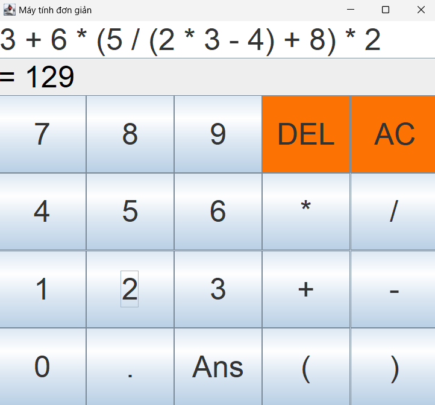
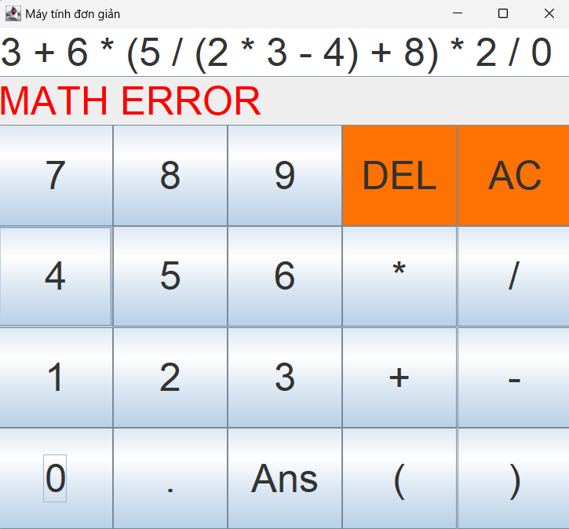

# Máy tính đơn giản(demo)

- Các phép toán cộng trừ nhân chia
- Nhập đến đâu hiện kết quả đến đó
- Tính ngoặc trong cùng trước, tính nhân chia trước, cộng trừ sau
- Báo lỗi khi chia cho 0
- Có thể dùng DEL để xóa sửa lại phép tính
- Có thể dùng AC để reset ô nhập dữ liệu
- Có thể dùng Ans để lấy kết quả của phép tính trước để tính cho phép tính sau

**_ Bản demo chưa dùng cho nhập từ bàn phím _**
